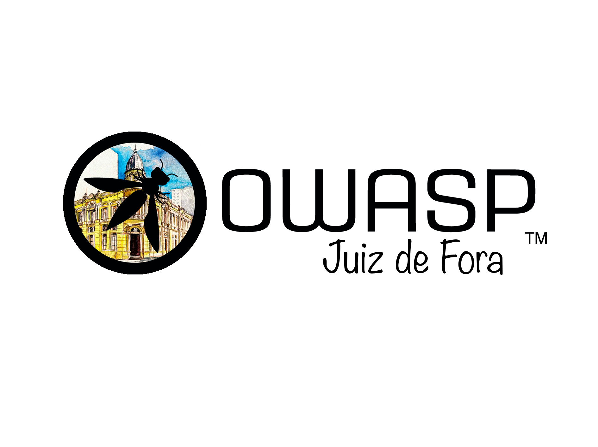

---

layout: col-sidebar
title: OWASP Juiz de Fora
tags: chapter-juiz-de-fora
level: 0
region: South America
country: Brazil
meetup-group: owasp-juiz-de-fora-chapter

---

## Seja bem-vindo a página da OWASP Chapter Juiz de Fora!

 

 
A OWASP Juiz de Fora é o segundo capítulo mineiro entre os mais de duzentos e sessenta e cinco capítulos ativos ao redor do mundo. Nosso propósito é promover a conscientização sobre segurança de software, capacitando indivíduos a tomarem decisões embasadas para reduzir riscos e fortalecer a proteção de aplicações.
Realizaremos eventos para estimular o compartilhamento de experiências, debates e a evolução contínua no campo da segurança da informação. Além disso, contamos com iniciativas ativas, onde voluntários podem contribuir no desenvolvimento de ferramentas e materiais que impactam positivamente a comunidade global. 
 
Juiz de Fora, localizada na Zona da Mata de Minas Gerais, teve um crescimento impulsionado pelo café no século XIX e pela industrialização no século XX.
A cidade se destacou com a instalação da Usina Hidrelétrica de Marmelos em 1889, a primeira da América do Sul, e pela chegada da Estrada de Ferro Dom Pedro II em 1875, que conectou a região ao Rio de Janeiro e ao restante do país.
A fundação da Universidade Federal de Juiz de Fora (UFJF) em 1960 consolidou a cidade como um importante polo educacional e de pesquisa.
Com uma economia diversificada, Juiz de Fora preserva sua relevância cultural, sendo berço de artistas como Murilo Mendes e Pedro Nava. 
 

## Por que fazer parte da OWASP Juiz de Fora?
<ul>
<li>Eventos com especialistas proporcionando aprendizado prático e debates sobre segurança de software.</li>
<li>Participar da comunidade amplia conhecimentos, fortalece habilidades e gera novas oportunidades.</li>
<li>A participação nas sessões, encontros e eventos da OWASP Juiz de Fora são totalmente gratuitos, permitindo interação e a troca de experiências entre profissionais de todos os níveis.</li>
</ul>
 

# Contribuir com a OWASP é investir no seu sucesso profissional!

 **Expanda Sua Rede e Carreira**: Participe dos encontros do capítulo de Juiz de Fora e eventos da OWASP para se conectar com especialistas e acessar oportunidades exclusivas na área de segurança de aplicações.

 **Faça a Diferença na OWASP**: Exerça seu direito de voto nas eleições do Conselho Global e contribua para o futuro da organização.

 **Aprimore Suas Habilidades**: Tenha descontos em treinamentos e eventos, além de acesso a todos os projetos da OWASP para aprimorar seus conhecimentos em AppSec.

 **Utilize Ferramentas Exclusivas**: Aproveite o Google Workspace com um endereço OWASP.org e explore a plataforma [Ubiq](https://www.ubiqsecurity.com/owasp) para facilitar a implementação de criptografia.

 **Contribua com a Comunidade**: Seja voluntário em projetos da OWASP e no capítulo de Juiz de Fora para fortalecer a segurança de software globalmente.

 

### Faça parte da comunidade global que está avançando na segurança de software.

👉 Torne-se membro hoje mesmo: [Link para Associação OWASP](https://owasp.org/membership/)

 

## Equipe OWASP Juiz de Fora

Atualmente, o OWASP Juiz de Fora é liderado por [Henrique Cabral](https://www.linkedin.com/in/cabralsecurity/), [Kevin Azevedo](https://www.linkedin.com/in/kevin-azevedo-278526157/) e [Igor Baio](https://www.linkedin.com/in/igor-baio-272a24167/).

 

## Sobre o Projeto OWASP

Segue uma lista de alguns dos principais projetos da comunidade

  - OWASP Top 10 - 2021 
    <https://owasp.org/Top10/>
  - OWASP Software Assurance Maturity Model (SAMM)
    <https://owasp.org/www-project-samm/>
  - OWASP Application Security Verification Standard (ASVS)
    <https://owasp.org/www-project-application-security-verification-standard/>
  - OWASP Top 10 for LLM
    <https://owasp.org/www-project-top-10-for-large-language-model-applications/>
  - OWASP Mobile Security Project
    <https://owasp.org/www-project-mobile-security/>
  - OWASP Cloud Security Project
    <https://owasp.org/www-project-cloud-security/>
  - OWASP API Security Project
    <https://owasp.org/www-project-api-security/>
  - OWASP Juice Shop
    <https://owasp.org/www-project-juice-shop/>
  - Conheça os outros projetos
    <https://owasp.org/projects/>

 

## Próximos Eventos
---------------------

Nós utilizamos o Meetup para manter uma agenda de eventos, confira nossa página na plataforma: [Juiz de Fora Meetup Group](https://www.meetup.com/owasp-juiz-de-fora-chapter/)

Nossos encontros são sempre abertos para o público, e você não precisa ser um membro OWASP para participar. Entretanto, considere se juntar à OWASP  [seja um membro OWASP](https://owasp.org/membership/) se você considera que nossas comunidades, projetos e encontros são valiosos, considere também patrocinar este capítulo.

 



 
